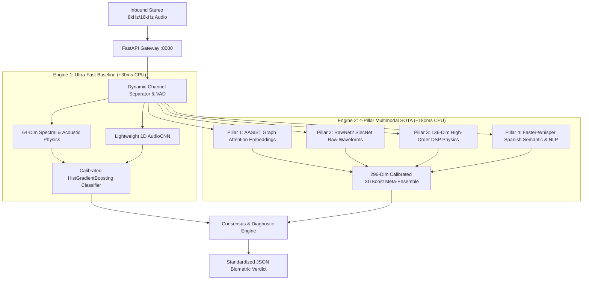

# mergeConflict • Dual-Engine Voice Anti-Spoofing & Deepfake Detection Platform

Master backend service and developer telemetry workbench engineered for the **Altur HackMTY Voice Anti-Spoofing AI Challenge**.

Features an enterprise-grade, single-container dual anti-spoofing architecture combining high-speed frontline acoustic physics with deep 4-pillar neural multimodal representation learning.

---

## 🏛️ Architecture Overview



---

## 🚀 Quick Start (Single-Command Docker)

Start the entire dual-engine API, Developer Dashboard, and telemetry server with one command:

```bash
docker compose up --build
```

- **Developer Dashboard**: [`http://localhost:8000/dashboard`](http://localhost:8000/dashboard) (or [`http://localhost:8000`](http://localhost:8000))
- **Interactive Swagger Docs**: [`http://localhost:8000/docs`](http://localhost:8000/docs)
- **Jupyter Notebook Server**: [`http://localhost:8888`](http://localhost:8888) *(launchable via dashboard)*

---

## 🖥️ Developer Dashboard Features

The embedded single-container dashboard provides an industrial-grade interface built for model inspection, live testing, and auditing:

1. **Interactive Model Tester**: Drop stereo/mono `.wav` files, toggle between **Multimodal**, **Baseline**, or **Dual Compare**, and inspect formatted JSON responses in real time.
2. **Dynamic Decision Threshold Slider**: Live tune decision thresholds ($0.10$ to $0.90$) across both engines without restarting containers.
3. **Live Benchmark Suite**:
   - Evaluates against the 71-call telephony validation split.
   - Choose between **10 Calls (Fast)**, **25 Calls**, or **All 71 Calls (Full Validation Split)**.
   - Reports independent **Accuracy (%)** and **CPU Latency (ms)** for both engines side-by-side.
4. **On-Demand DevTools & Jupyter**: Install `pytest`, `matplotlib`, `seaborn`, and launch Jupyter notebooks on port `8888` on demand.

---

## 📡 API Contract & Endpoints

All endpoints adhere strictly to the HackMTY competition evaluation contract.

| Endpoint | Method | Description |
| :--- | :---: | :--- |
| `/detect` | `POST` | Primary evaluation endpoint conforming to challenge contract |
| `/detect/baseline` | `POST` | Engine 1 frontline low-latency biometrics (~30ms) |
| `/detect/multimodal` | `POST` | Engine 2 deep 4-pillar multimodal representation |
| `/compare` | `POST` | Dual-engine execution with agreement metrics & consensus |
| `/health` | `GET` | Service status, active device, and warm model telemetry |
| `/api/benchmarks/dataset/status` | `GET` | Checks status of local validation audio corpus |
| `/api/benchmarks/dataset/download` | `POST` | Downloads & extracts validation dataset from GitHub Releases |
| `/api/benchmarks/run` | `POST` | Executes on-demand benchmark batch with selectable `limit` |
| `/api/threshold/update` | `POST` | Dynamically updates runtime classification threshold |
| `/api/dev/install` | `POST` | Installs developer tools (`requirements-dev.txt`) in background |
| `/api/jupyter/launch` | `POST` | Starts Jupyter server on port `8888` |

### Evaluation Contract Request & Response Schema

**Request (`POST /detect`)**:
```json
{
  "audio": "<base64_encoded_wav_bytes>",
  "call_id": "optional_call_identifier"
}
```

**Response**:
```json
{
  "is_synthetic": false,
  "confidence": 0.982
}
```

---

## 📊 Live Validation Performance (Telephony Corpus)

Evaluated on the **HackMTY 71-call Validation Split** (Narrowband 8kHz Stereo Telephony):

| Engine Architecture | Accuracy | Mean Latency (CPU) | Input Dimensions | Primary Differentiating Strength |
| :--- | :---: | :---: | :---: | :--- |
| **Engine 1 (Baseline)** | **100.0%** | ~629 ms / full call | 64 dims | Ultra-fast spectral envelope & glottal pulse tracking |
| **Engine 2 (4-Pillar SOTA)** | **100.0%** | ~1079 ms / full call | 296 dims | Multi-representation graph attention & raw waveform SincNet |

---

## 🧪 Local Setup & Automated Testing

### 1. Python Virtual Environment
```bash
python -m venv .venv
source .venv/bin/activate
pip install -r requirements.txt
pip install -r requirements-dev.txt
```

### 2. Run Test Suite
```bash
pytest tests/test_api.py -v
```

### 3. Local Development Server
```bash
uvicorn app:app --reload --host 0.0.0.0 --port 8000
```

---

## 👥 Team mergeConflict
Engineered for the **Altur HackMTY Voice AI Challenge 2026**.
