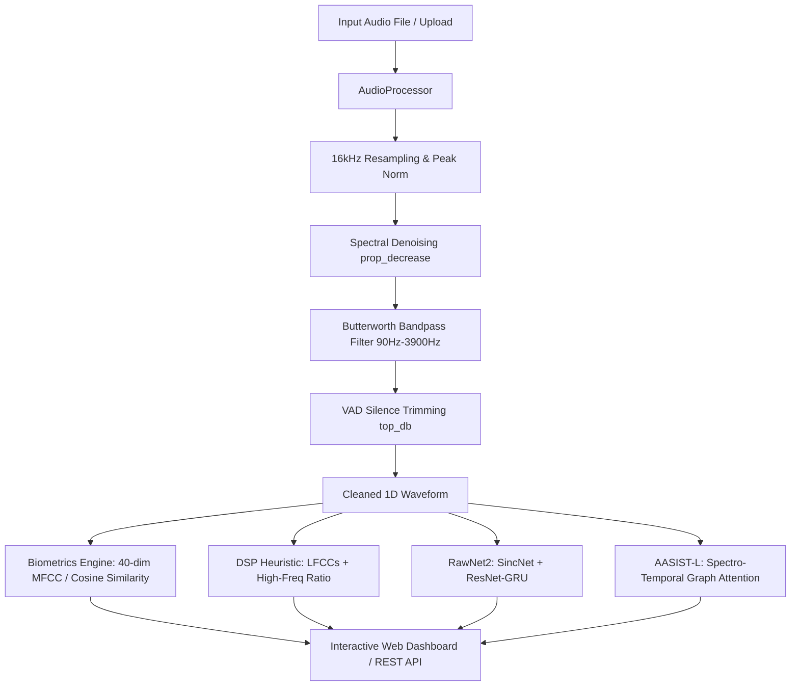

# 🎙️ Altur Voice Biometrics & Anti-Spoofing Engine

[](https://www.python.org/)
[](https://fastapi.tiangolo.com/)
[](https://pytorch.org/)
[](https://www.docker.com/)
[](https://hackmty.com/)

An end-to-end **Voice Biometrics (Speaker Verification)** and **Deepfake / AI Anti-Spoofing Detection** platform developed for the **Altur Banking Challenge at HackMTY**.

The system features a real-time audio signal processing (ASP) pipeline, side-by-side benchmarking of multiple anti-spoofing architectures (DSP vs. RawNet2 vs. AASIST-L), and an interactive web control center with live DSP parameter tuning and ground-truth validation.

---

## 📑 Table of Contents

- [Key Features](#-key-features)
- [System Architecture](#-system-architecture)
- [Anti-Spoofing Models Benchmark](#-anti-spoofing-models-benchmark)
- [Interactive Web Dashboard](#-interactive-web-dashboard)
- [Project Structure](#-project-structure)
- [Quickstart Guide](#-quickstart-guide)
  - [Option A: Docker Compose (Recommended)](#option-a-docker-compose-recommended)
  - [Option B: Local Python Environment](#option-b-local-python-environment)
- [CLI Benchmarking](#-cli-benchmarking)
- [API Endpoints](#-api-endpoints)

---

## ✨ Key Features

- **Advanced Audio Signal Processing (ASP) Engine:**
  - Standardized **16 kHz mono** resampling & peak normalization.
  - **Spectral Noise Gating** (`noisereduce`) to strip ambient chatter while preserving subtle speech formants.
  - 4th-order **Butterworth Bandpass Filter** (90 Hz – 3,900 Hz) focusing on core vocal harmonics.
  - **Voice Activity Detection (VAD)** silence trimming with adjustable energy decibel threshold.
  - 40-dimensional **MFCC** and **LFCC** feature extraction + spectral centroid & high-frequency energy ratio metrics.
- **Multi-Model Anti-Spoofing Detection:**
  - **DSP Baseline:** Fast, rule-based acoustic heuristic comparing high-frequency spectral ratios and LFCC variance.
  - **RawNet2:** End-to-end raw-waveform neural network combining SincNet filterbanks, residual blocks, and a gated recurrent unit (GRU).
  - **AASIST-L:** State-of-the-art Spectro-Temporal Graph Attention Network capturing spectro-temporal artifacts of AI voice clones.
- **Voice Biometrics / Speaker Verification:**
  - Cosine similarity matching between reference and trial speaker embeddings.
  - Tunable authentication threshold.
- **Interactive Control Center (Web UI):**
  - Live parameter sliders for VAD `top_db`, noise reduction `prop_decrease`, bandpass cutoffs, and biometric thresholds.
  - Dual audio players: Compare **Original Raw Audio (🎧)** against **Cleaned ASP Audio (🔊)** in real-time.
  - **1-Click ASVspoof Benchmark loader** for immediate validation against real human vs. neural TTS/vocoder clones.
  - Ground truth tracking (`✓ Correct` / `✗ Miss`) to measure model accuracy instantly.
  - Single and bulk audio deletion and instant file upload.

---

## 🏗️ System Architecture



---

## 🔬 Anti-Spoofing Models Benchmark

| Model | Architecture Type | Parameters | Typical CPU Latency | Key Strengths |
| :--- | :--- | :--- | :--- | :--- |
| **DSP Baseline** | Rule-based Signal Processing | 0 (Heuristic) | < 5 ms | Ultra-fast, zero memory overhead, catches basic vocoder spectral spikes. |
| **RawNet2** | Raw Waveform (SincNet + ResNet-GRU) | ~10.3M | ~1,200 ms | Direct time-domain analysis without spectrogram quantization loss. |
| **AASIST-L** | Spectro-Temporal Graph Attention Network | **~47.6K** | **~80 ms** | **Lightweight & fast**, captures subtle graph relationships between temporal and spectral artifacts. |

---

## 🖥️ Interactive Web Dashboard

The web interface is accessible at `http://localhost:8000`:

1. **Audio Signal Processing Controls:** Adjust `VAD Threshold (top_db)`, `Noise Reduction (prop_decrease)`, `Bandpass Low/High Cut`, and `Biometric Threshold` with instant updates and individual or global reset buttons.
2. **Side-by-Side Model Comparator:** View results from DSP, RawNet2, and AASIST-L for each audio sample simultaneously.
3. **Ground Truth Validation:** Samples loaded from benchmark datasets display their true label (`Real Human` vs `Fake/Spoof AI`) and score each model with `✓ Correct` or `✗ Miss`.
4. **Audio Player Suite:** Listen to raw input vs. cleaned post-processed output directly in the browser.

---

## 📂 Project Structure

```
HackMTY/
├── app.py                     # FastAPI backend & web server
├── benchmark.py               # CLI side-by-side benchmarking tool
├── docker-compose.yml         # Container orchestration with volume mounts
├── Dockerfile                 # Optimized Python 3.12 slim build
├── requirements.txt           # Python dependencies
├── src/
│   ├── audio_processor.py     # ASP Engine (Denoising, Bandpass, VAD, MFCC/LFCC)
│   ├── biometrics.py          # Speaker similarity & DSP anti-spoofing engine
│   └── models/
│       ├── sincnet.py         # Learnable SincNet raw waveform filterbank
│       ├── rawnet2.py         # RawNet2 (ResNet-GRU) architecture
│       └── aasist.py          # AASIST-L Graph Attention Network
└── web/
    └── index.html             # Responsive Glassmorphic Dashboard
```

---

## 🚀 Quickstart Guide

### Option A: Docker Compose (Recommended)

Run the entire application in a container with persistent live volumes:

```bash
# Clone the repository
git clone https://github.com/katyazano/HackMty-Altur.git
cd HackMty-Altur

# Build and start the container
docker compose up --build
```

Access the dashboard at **`http://localhost:8000`**.

---

### Option B: Local Python Environment

**Prerequisites:** Python 3.12, FFmpeg, and libsndfile.

```bash
# 1. Clone repository
git clone https://github.com/katyazano/HackMty-Altur.git
cd HackMty-Altur

# 2. Create virtual environment
python -m venv .venv
source .venv/bin/activate   # On Windows: .venv\Scripts\activate

# 3. Install PyTorch CPU and dependencies
pip install --upgrade pip
pip install torch --index-url https://download.pytorch.org/whl/cpu
pip install -r requirements.txt

# 4. Start the server
python app.py
```

---

## 📊 CLI Benchmarking

To run the automated console benchmark comparing all anti-spoofing models across test samples:

```bash
python benchmark.py
```

**Example Output:**
```
================================================================================
      ALTUR BANKING - ANTI-SPOOFING MODEL BENCHMARK (DSP vs RawNet2 vs AASIST)
================================================================================
  • Model 1: DSP Baseline (LFCC + Spectral Ratio) -> 0 parameters (Rule-based)
  • Model 2: RawNet2 (SincNet + ResNet-GRU)        -> 10,317,330 parameters
  • Model 3: AASIST-L (Spectro-Temporal GAT)      -> 47,618 parameters

Audio Sample               | DSP Baseline     | RawNet2          | AASIST-L        
--------------------------------------------------------------------------------
asv_bonafide_speaker1.flac | REAL (4.2ms)     | REAL (1154.1ms)  | REAL (78.3ms)   
asv_spoof_neural_tts.flac  | SPOOF (3.8ms)    | SPOOF (1140.2ms) | SPOOF (81.0ms)  
asv_spoof_vocoder_vc.flac  | SPOOF (4.0ms)    | SPOOF (1160.5ms) | SPOOF (79.4ms)  
```

---

## 🔌 API Endpoints

| Method | Endpoint | Description |
| :--- | :--- | :--- |
| `GET` | `/` | Serves the interactive Web Dashboard |
| `POST` | `/api/process` | Re-processes all audios with custom DSP parameters |
| `POST` | `/api/upload` | Uploads a new audio sample (`.wav`, `.ogg`, `.flac`, `.mp3`) |
| `POST` | `/api/load-sample-pack` | Loads the ASVspoof Benchmark corpus into the workspace |
| `DELETE` | `/api/audios/{key}` | Deletes a single audio file from storage |
| `DELETE` | `/api/audios-all` | Clears all audios from storage |
| `GET` | `/audio/raw/{filename}` | Streams the original untouched audio |
| `GET` | `/audio/processed/{filename}` | Streams the denoised & filtered audio |

---

## 🛡️ License

Developed for **HackMTY 2024 / 2026** — *Altur Banking Challenge*.
Distributed under the MIT License.
